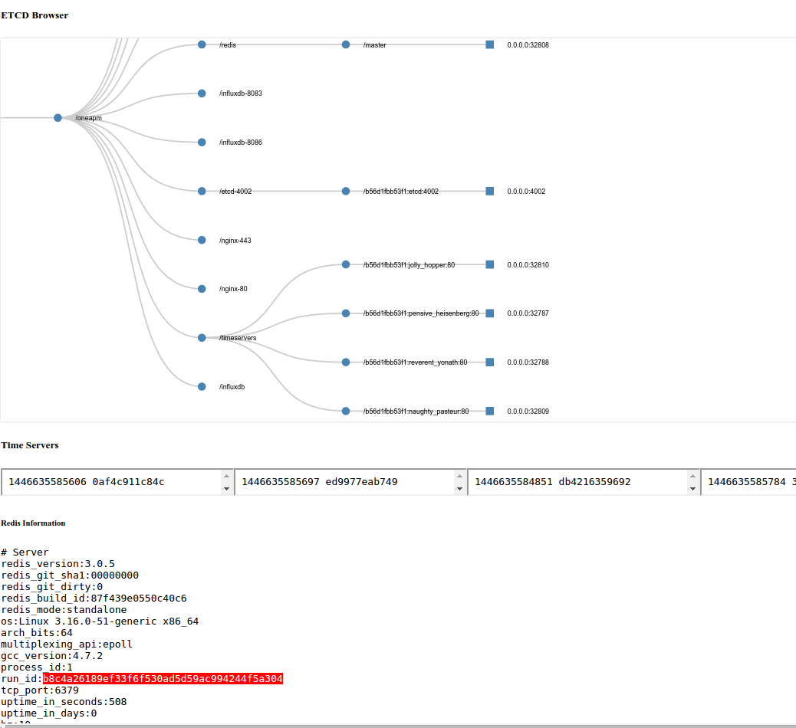

# oneapm-nodejs-etcd-demo

## 准备环境

第一步，启动 ETCD

```
sudo docker run -d -p 4002:4002 --name etcd quay.io/coreos/etcd \
  -listen-client-urls http://etcd:4002 -advertise-client-urls http://etcd:4002
```

启动好后访问下面的地址：

[http://localhost:4002/v2/keys?recursive=true](http://localhost:4002/v2/keys?recursive=true);

可以看到还没有存任何东西

第二步，启动 Registrator

```
sudo docker run -d --name=registrator --volume=/var/run/docker.sock:/tmp/docker.sock \
 gliderlabs/registrator:latest -ip 0.0.0.0 etcd://etcd:4002/oneapm
```

再次访问之前的地址可以看到

[http://localhost:4002/v2/keys?recursive=true](http://localhost:4002/v2/keys?recursive=true);

第三步，启动一台 Redis

```
#!/usr/bin/env bash
sudo docker run -P -d -e SERVICE_NAME=redis redis
```

[](http://localhost:4002/v2/keys/oneapm/redis?recursive=true)


第四步, 启动 ETCD UI

```sh
node index.js
```

;


## 参考

https://github.com/coreos/etcd/blob/master/Documentation/api.md

http://gliderlabs.com/registrator/latest/user/run/

http://gliderlabs.com/registrator/latest/user/services/
